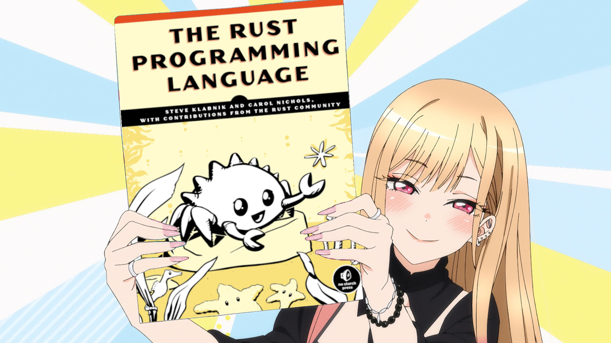

# 러스트 전사

요즘 특히 블록체인쪽에서 인기가 많은 러스트를 배우고 싶다는 주변 의견이 있고,
마침 러스트 프로그래밍을 시작해서 느슨하고 비동기적인 러스트 모임을 만듭니다.
따로 모이지 않고 각자 읽어보고 궁금한 점은 이슈로 이야기 나눌까 합니다.
러스트를 사용하지 않더라도 교양삼아 살펴보면 좋습니다.

* 교재: [공식 문서](https://doc.rust-lang.org/book/)
  ([종이책](https://www.amazon.com/-/en/dp/1718503105/))의
  [한글 번역](https://rust-kr.github.io/doc.rust-kr.org/)
* 놀이터: [Rust Playground](https://play.rust-lang.org/)
* 매주 1~2장, 사이사이에 간단한 프로그램 만들기

## 목차

* [시작](openning.md)
* 1\. 시작해봅시다
* 2\. 추리 게임
* 3\. 일반적인 프로그래밍 개념
* 4\. 소유권 이해하기

* 5\. 구조체로 연관된 데이터를 구조화하기
* 6\. 열거형과 패턴 매칭
* 7\. 커져 가는 프로젝트를 패키지, 크레이트, 모듈로 관리하기
* 8\. 일반적인 컬렉션
* 9\. 에러 처리
* 10\. 제네릭 타입, 트레잇, 라이프타임
* 11\. 자동화 테스트 작성하기
* 12\. I/O 프로젝트: 커맨드 라인 프로그램 만들기
* 13\. 함수형 언어의 특성들: 반복자와 클로저
* 14\. 카고와 Crates.io 더 알아보기
* 15\. 스마트 포인터
* 16\. 겁 없는 동시성
* 17\. 러스트의 객체 지향 프로그래밍 기능들
* 18\. 패턴과 매칭
* 19\. 고급 기능들
* 20\. 최종 프로젝트: 멀티스레드 웹 서버 구축하기
* 21\. 부록

## 마치고 보면 좋은 글

* [Asynchronous Programming in Rust](https://rust-lang.github.io/async-book/)
* [Tokio Tutorial](https://tokio.rs/tokio/tutorial)
* [Rust Atomics and Locks](https://marabos.nl/atomics/)

